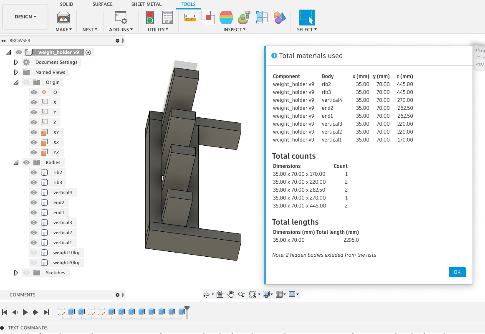

# Fusion360 parts list with dimensions, counts, and total lengths

The add-in will display a summary of materials used in your design, including dimensions, counts from each size, 
and total length of material used.

Read installation instructions [here](https://google.com).

